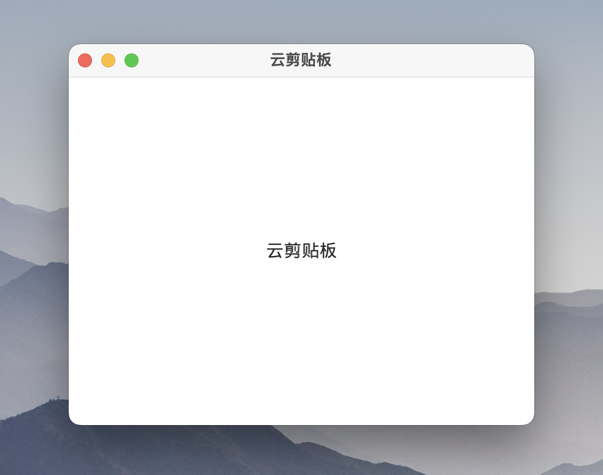
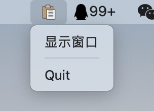

# 云剪贴板客户端 (go.clipboard-client-fyne)

> 云剪贴板的客户端

## 效果预览

- 客户端效果图(主窗口新图片预览)\
     

- 托盘效果图\
      


### 云端部署，客户端依赖

- [云剪贴板服务端(基于Golang)](https://gitee.com/zinface/go.clipboard-server)

### 应用逻辑

1. 监听本地剪贴板变化并同布到服务器
2. 轮询监视服务器最新变化(3秒一次)
3. 将服务器新内容同步到本地剪贴板

### 截图快捷键

* **macOS**: 截图：`Ctrl+Shift+Command+4`
* **Linux**: 截图：`Ctrl+Shift+PrintScreen`
* **Windows**: 截图：`Shift+Win+s`

## 部署

### 构建

```
make build
```

构建好的内容在 `bin/clipboard-client`。

### 运行

```
./bin/clipboard-client
```

若需指定服务器地址，则使用 `-a` 参数：

```
./bin/clipboard-client -a http://localhost:9090
```

若需查看进一步的日志调试信息，可以使用 `-v`。
